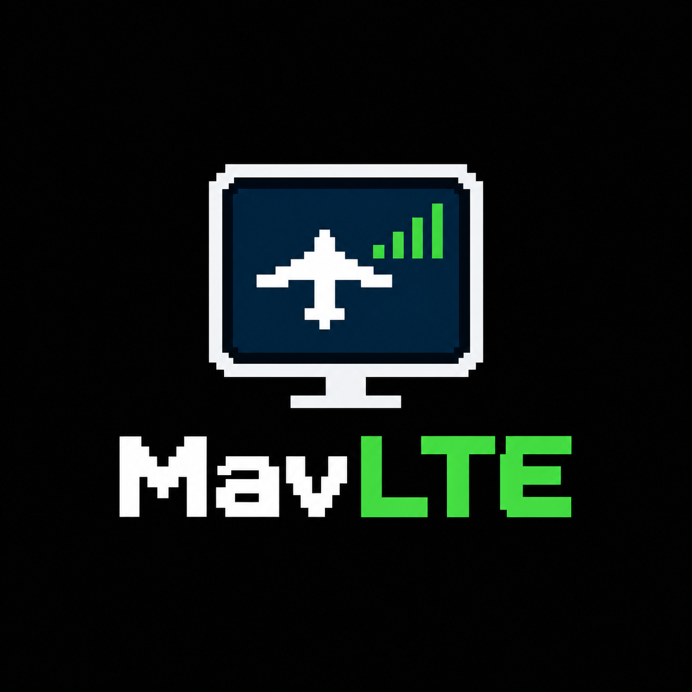

<p align="center"></p>

# MavLTE

Telemetry and command link for an ArduPilot aircraft over the mobile network, using the
Waveshare **ESP32-S3-A7670E-4G** board on the aircraft and a small relay server in the cloud.
Mission Planner (or QGroundControl) connects from anywhere with internet access, through the
MavLTE app on your laptop. A sibling of MavGCS and MavJOY.

Repository: <https://github.com/kolabuzlu/MavLTE>

```
 aircraft   flight controller ──UART── ESP32-S3 + A7670E ══ 4G ══╗
            (TELEM port)               (this firmware)           ║
                                                                 ╠══ relay server (mavrelay.py on a VPS)
 ground     Mission Planner ──UDP/TCP── MavLTE app ═ internet ═══╝
                                        (on your laptop)
```

- **Both ends dial out** to the relay, so the SIM's carrier-grade NAT and your laptop's router
  need no port forwarding.
- **MAVLink passes through untouched**: MAVLink 1, MAVLink 2 and MAVLink 2 signing all work end
  to end. The bridge only cuts the stream at frame boundaries, so a lost packet never corrupts
  neighbouring messages.
- **Authenticated tunnel**: every UDP packet carries an HMAC-SHA256 tag and a sequence number, so
  nobody can inject traffic, replay it, or divert your aircraft's downlink to themselves. The
  vehicle and the GCS side have separate keys. See [docs/PROTOCOL.md](docs/PROTOCOL.md).
- **Saves mobile data**: telemetry is batched (50 ms by default) and held back while no GCS is
  connected; it resumes within about a second when you connect.
- **Recovers by itself** from lost coverage, modem resets, IP address changes and relay restarts.
- **Link status**: the MavLTE app shows the aircraft's signal, round-trip time and packet loss.

| Folder | What |
|---|---|
| [firmware/](firmware) | ESP-IDF firmware for the ESP32-S3 (PlatformIO or `idf.py`) |
| [relay/](relay) | `mavrelay.py`: the relay server, the GCS agent and a Python vehicle for bench tests; `MavLTE.pyw` / `mavlte.py`: the MavLTE app (the GCS agent as a window), `build_release.py` makes it into `MavLTE.exe`; `sitl_demo.py`: the whole link with ArduPilot SITL on one PC; `PlaneSim.pyw` / `plane_sim.py`: SITL as a plane with a battery switch and a virtual LTE module |
| [docs/PROTOCOL.md](docs/PROTOCOL.md) | Tunnel protocol |

## Setup, in order

1. [Relay server](#1-relay-server) on a VPS: creates the two keys.
2. [Firmware](#2-firmware): put the relay address, the vehicle key and your APN in, build, flash.
3. [Wiring and power](#3-wiring-and-power) in the aircraft.
4. [ArduPilot parameters](#4-ardupilot-parameters) for the serial port, stream rates and MAVLink signing.
5. [MavLTE app and Mission Planner](#5-mavlte-app-and-mission-planner) on your laptop.

Before the board arrives you can try everything else with ArduPilot SITL on your PC, in one
command: see [Bench tests](#bench-tests).

## 1. Relay server

Any small Linux VPS with a public IPv4 address does the job (1 vCPU and 512 MB RAM is plenty).
Pick a data centre close to where you fly (Istanbul or Frankfurt from Turkey) to keep the
round trip short. It needs Python 3.8 or newer, which every current Debian and Ubuntu has.

```bash
scp -r relay you@your-server:
ssh you@your-server
cd relay && sudo sh install-server.sh
```

The installer creates `/etc/mavrelay/mavrelay.ini` with two fresh keys and **prints them**,
opens UDP port 14650 in `ufw` if it is active, and starts the `mavrelay` systemd service. If your
provider has its own firewall (security group), open **UDP 14650** there too.

- **Vehicle key** goes into the firmware.
- **GCS key** goes into the MavLTE app on your laptop.

Watch it work with `journalctl -u mavrelay -f`. Every five minutes it logs a summary, and it
logs every connection, address change and link loss as it happens.

## 2. Firmware

The firmware talks to the modem over its UART (PPP on GPIO17/18, the same on both board
versions), so it does not depend on the USB DIP switch. It detects the board version by itself.

**Board versions.** V1 boards (sold until about December 2025) have an ESP32-S3R2; V2 boards
have an ESP32-S3R8, "VER 2.0" printed on the back and a different pinout. The firmware reads
the chip to tell them apart and prints `board version V1` or `V2` at start-up.

**Settings.** Open *menuconfig* (`pio run -t menuconfig`, or `idf.py menuconfig`) and go to
**MavLTE**:

| Setting | Value |
|---|---|
| Relay server | your server's name or IP address |
| Relay server UDP port | `14650` |
| Vehicle key | the vehicle key the installer printed |
| APN of the SIM card | `internet` (Turkcell, Vodafone TR and Türk Telekom) |
| SIM PIN | empty; better remove the PIN with a phone first |
| Mobile network technology | Automatic (LTE, falls back to 2G) or LTE only |
| Board version, flight controller pins | leave on detect / `-1` |
| Flight controller baud rate | `115200` |

The rest (modem UART speed, batching, sending with no GCS connected) can stay as they are;
each has a help text. PlatformIO keeps your settings, including the key, in
`firmware/sdkconfig.esp32s3-a7670e`: don't publish that file.

**Build and flash.** With PlatformIO (VS Code or the command line) in the `firmware` folder:

```bash
pio run -t upload
pio device monitor
```

Plain ESP-IDF 6.0 works too: `idf.py set-target esp32s3`, then `idf.py build flash monitor`.
The board's USB-C port goes through a USB hub to a CH343 USB-serial chip on the ESP32's UART0,
so flashing and the log use the COM port that appears on your PC. (The ESP32's own USB pins are
wired to the modem and never show up on the PC.)

**DIP switches.** Set all four **OFF**:

| Switch | OFF means |
|---|---|
| 1 CAM | camera power off (no camera is used) |
| 2 HUB | the USB hub and CH343 only run while USB-C is plugged in |
| 3 4G | the firmware switches the modem's power, so it can power-cycle a hung modem |
| 4 USB | the modem's USB goes to the ESP32 (unused), not to your PC |

With 4G ON the modem runs anyway, but the firmware can then only reset it by AT command; the
log warns about it.

**A healthy start** takes about 20–40 s and logs (shortened):

```
I (512) board: Waveshare ESP32-S3-A7670E-4G, board version V2
I (522) bridge: flight controller: ESP32 TX GPIO2 -> FC RX, ESP32 RX GPIO3 <- FC TX, 115200 baud; relay ...
I (532) modem: modem power on (GPIO21)
I (9870) modem: modem UART at 921600 baud
I (14210) modem: registered with Turkcell, LTE, signal -75 dBm
I (16150) bridge: mobile data up, address 10.83.12.4
I (16420) bridge: relay relay.example.com is 203.0.113.10, port 14650
I (16530) bridge: connected to the relay (session 5c1e0a77)
```

Once a minute the bridge logs its counters: relay state, round-trip time, bytes each way.

**The RGB LED** on the board shows the state without a laptop:

| LED | Meaning |
|---|---|
| red, blinking | modem, SIM or network problem; the log says which |
| yellow, blinking | modem starting, searching for the network |
| blue | mobile data up, relay not answering (yet) |
| green, flashing | connected to the relay, no GCS connected (telemetry held back) |
| green | connected to the relay and a GCS is connected |

## 3. Wiring and power

**Flight controller.** Use a free TELEM port. Both sides use 3.3 V logic, so wire directly:

| Signal | V1 board | V2 board |
|---|---|---|
| ESP32 TX → flight controller RX | **IO41** | **IO2** |
| ESP32 RX ← flight controller TX | **IO42** | **IO3** |
| Ground | GND | GND |

The pins are labelled on the board. Do not connect the flight controller's 5 V pin. The pin
headers may come loose in the box and need soldering. If you need other pins, set them in
menuconfig; never use GPIO17/18 (modem), 43/44 (USB-serial), 45/46 or, on V1, GPIO33 and
on V2, GPIO21 (modem power).

**Power.** The modem draws current peaks of up to 2 A, so do not run the board from the
flight controller. Either:

- feed **5 V from its own BEC (2 A or more)** into the header's **5V** pin, or
- run it from an **18650 cell** in the holder: it also keeps the link alive if the flight
  battery fails. Both together work as well; the BEC then charges the cell.

The 5V pin is wired straight to the USB-C port's power line. Unplug the BEC (or the flight
battery) before you connect USB-C to a PC.

**Antennas and SIM.** Screw the LTE antenna onto the modem's main antenna connector; the GNSS
antenna is not needed. Insert a nano-SIM with a data plan, PIN removed.

## 4. ArduPilot parameters

The examples use TELEM2, which is `SERIAL2`; use the number of the port you wired.

| Parameter | Value | Why |
|---|---|---|
| `SERIAL2_PROTOCOL` | `2` | MAVLink 2, which signing needs |
| `SERIAL2_BAUD` | `115` | 115200 baud, same as the firmware setting |
| `BRD_SER2_RTSCTS` | `0` | no flow-control wires (only on ports that have RTS/CTS) |
| `SERIAL2_OPTIONS` | add `4096` (bit 12, "Ignore Streamrate") | ArduPilot 4.6 and older: stops Mission Planner from raising the data rates below when it connects |
| `MAVn_OPTIONS` | add `4` (bit 2) | the same for ArduPilot 4.7 and newer |
| `FS_GCS_ENABL` | `0` | no GCS failsafe on 4G dropouts while ELRS is your main link |

**Stream rates.** Mobile data is paid by the byte, so ask for what you actually look at. The
stream rate parameters are numbered by MAVLink port, not by serial port: port 0 is USB, then
every serial port with a MAVLink protocol counts up in order. If `SERIAL1` is your ELRS receiver
(protocol 23) and `SERIAL2` is the 4G bridge, the bridge is MAVLink port 1: `SR1_*` in ArduPilot
4.6 and older, `MAV2_*` in 4.7 and newer (the new names count from 1). When in doubt, search
the parameter list for `SR` or `MAV` and look at which port's rates Mission Planner changed.
**ArduPilot reads these rates only when it starts: reboot the flight controller after setting
them.** On 4.7 and newer use only `MAVn_OPTIONS` for "Ignore Streamrate"; a prearm check
complains if the old `SERIALn_OPTIONS` bit is still set.

| Group | Rate (Hz) | Gives you |
|---|---|---|
| `EXTRA1` | 4 | attitude for the HUD |
| `POSITION` | 2 | position on the map |
| `EXTRA2` | 2 | airspeed, altitude, climb, throttle |
| `EXT_STAT` | 1 | battery, GPS, mission progress, system status |
| `EXTRA3` | 1 | wind, EKF status, vibration |
| `RAW_SENS`, `RC_CHAN`, `RAW_CTRL`, `ADSB` | 0 | raw sensors, RC and servo values, ADS-B |

**MAVLink signing.** The relay only lets your own vehicle and MavLTE app in, but signing is what
guarantees that only your Mission Planner can command the aircraft, whatever happens on the
network. Connect the flight controller by USB, open *SETUP → Advanced → MAVLink Signing*, press
*ADD* to create a key and *USE* to put it on the flight controller. Mission Planner keeps the key
and signs everything it sends. The flight controller then ignores unsigned commands on
`SERIAL2`. USB is exempt, so you cannot lock yourself out.

## 5. MavLTE app and Mission Planner

**The MavLTE app.** On Windows, run **`MavLTE.exe`**: one file, no Python needed (to make it, see
[Development](#development)). With Python 3 (python.org) it also runs from the `relay` folder:
double-click **`MavLTE.pyw`** or run `python mavlte.py`. The first time it asks for the relay
server and the GCS key (later: ☰ → Settings). Both switches start off. Then:

- Switch **UDP** on to send to Mission Planner on 127.0.0.1:14550, and/or **TCP** to listen on
  127.0.0.1:5760. Change a port while its switch is off.
- Each card has two **LEDs**. **Available** (green, on the left) lights while the aircraft's LTE
  module is online at the relay, even with the switches off. **Connected** (blue, next to the
  switch) lights while it is online and that port is on. The bars show its 4G signal. The
  header shows the link to the relay, the *Aircraft* panel signal, round trip, packet loss and
  traffic, and ☰ → Show log the details.
- In Mission Planner pick **UDP**, port **14550**, or **TCP**, host **127.0.0.1**, port **5760**.
  QGroundControl finds UDP 14550 by itself.
- With both switches off the app only watches: the Available LEDs keep working, but the aircraft
  holds its telemetry back, so it uses almost no mobile data.

The app keeps its settings in the `[gcs]` section of `mavrelay.ini`: `MavLTE.exe` in
`%LOCALAPPDATA%\MavLTE\mavrelay.ini` (or in a `mavrelay.ini` next to the exe, if you put one
there, to carry it on a USB stick); from source, the one next to `mavlte.py`.

**Without the window**, the same agent runs on the command line (Python 3 and the `relay` folder)
with the same file: double-click `start-gcs.bat`, or run

```bash
python mavrelay.py gcs --server your-server.example.com:14650 --key <GCS key>
```

and the agent reports the link to the relay and the aircraft as text:

```
2026-09-30 14:02:11 INFO    connected to server 203.0.113.10:14650 (session 5c1e0a77)
2026-09-30 14:02:12 INFO    vehicle: online, LTE -71 dBm, rtt to server 64 ms, loss up 0.0% down 0.0%
```

The agent talks UDP to the relay, so a lost packet on a patchy laptop connection (a phone
hotspot in the field, say) does not stall everything behind it the way TCP would.

**Without the agent.** The relay can also offer a plain TCP port for Mission Planner
(`tcp_listen` in `mavrelay.ini`). Traffic on it is not authenticated, so by default only the
server itself may connect: reach it through an SSH tunnel,
`ssh -N -L 5760:127.0.0.1:5760 you@your-server`, then connect Mission Planner to TCP
127.0.0.1:5760. To open it to fixed addresses instead, list them in `tcp_allow`.

## Bench tests

**The whole link with SITL, on one PC.** `sitl_demo.py` starts ArduPilot SITL (Mission Planner's
copy) as the flight controller, `mavrelay.py vehicle` in place of the ESP32, a relay and the GCS
agent, and can make the link between vehicle and relay behave like a poor mobile connection:

```bash
cd relay
python sitl_demo.py                                # clean link
python sitl_demo.py --delay 80 --jitter 30 --loss 3   # 80 ± 30 ms each way, 3% packets lost
```

Close Mission Planner's own simulation first (it uses the same ports). In Mission Planner, choose
**UDP**, click Connect and accept port **14550**: you now see and command the simulated plane only
through the tunnel, as you will in the aircraft. Arm it, fly a mission, change modes. Every 10 s
the demo prints the mobile data the link would use.

**With the MavLTE app**, as you will fly: start `python sitl_demo.py --no-agent`, then
double-click `MavLTE.pyw` and switch UDP or TCP on. The demo puts its relay (127.0.0.1:14650)
and a key into `mavrelay.ini`, so the app connects without any setup. The demo also prints a
command line for the text agent.

The plane's "USB port" (SITL `SERIAL0`) is TCP 127.0.0.1:5780, which you can use to set up MAVLink
signing first, just like over USB on the real flight controller.

**Through your real relay server**, the SITL plane connects exactly as the ESP32 will, and the
MavLTE app connects to the same server:

```bash
python sitl_demo.py --server your-server:14650 --no-agent
```

It takes the vehicle key from the `[vehicle]` section of `mavrelay.ini` (`key = <vehicle key>`)
or from `--vehicle-key`. Give the MavLTE app the server and the GCS key.

**Plane simulator.** The same, as a window with the plane's power switches: double-click
`PlaneSim.pyw` (or run `python plane_sim.py`). It uses the `[vehicle]` section of `mavrelay.ini`.

- **Battery** powers the whole plane: on starts SITL, off stops it at once.
- **LTE module** is the modem. On, it starts up like the real one (about 16 s, or a couple of
  seconds with *Quick start*); off cuts it without a goodbye, as a power cut would. Its LED
  blinks like the board's RGB LED.
- **Coverage** sets the signal it reports and the delay and loss of its link, from *Excellent* to
  *No signal*.

Put the MavLTE app beside it and watch its LEDs follow: they go dark about 3 s after the plane
goes quiet.

**Real flight controller on USB.** `mavrelay.py vehicle` does in Python what the ESP32 does:
`python mavrelay.py vehicle --server your-server:14650 --key <vehicle key> --serial COM5:115200`
(needs `pip install pyserial`).

## Mobile data

Measured with ArduPlane 4.8 SITL through the tunnel (`sitl_demo.py` prints these numbers), counting
IP and UDP headers the way a mobile operator bills them:

| ArduPilot sends | Signing | Mobile data |
|---|---|---|
| the stream rates above (with "Ignore Streamrate") | on | **about 8 MB per hour** |
| the stream rates above | off | about 7 MB per hour |
| what Mission Planner asks for (all streams at 4 Hz) | on | about 24 MB per hour |

A full parameter download is about 0.1 MB. While no MavLTE app (or agent) is connected, the aircraft sends
no telemetry, only the link check (about 0.5 MB per hour). A longer batch interval saves header
bytes at the cost of telemetry delay; commands from the GCS are never delayed.

## In the aircraft

- **Keep ELRS as the primary link.** Expect 50–150 ms latency, multi-second gaps at cell
  handovers and patchier coverage at altitude. Use 4G for telemetry, mode changes and missions,
  not for stick control.
- **Range check.** Do an ELRS range check with the modem connected and transmitting. Keep the
  LTE antenna away from the RC receiver's antennas and from the GPS.
- **Wi-Fi and Bluetooth** stay off: the firmware never starts them, so they cannot interfere with
  2.4 GHz ELRS.

## Troubleshooting

| Symptom | Look at |
|---|---|
| MavLTE says the aircraft is not connected to the relay | The ESP32 log (`pio device monitor`): SIM, network registration, APN, relay address and key. |
| ESP32 log shows `Vehicle key is not set` | Set it in menuconfig, rebuild and flash. |
| `the modem does not answer on its UART` | Modem power: the 5 V supply, and whether the DIP switch or firmware turns the modem on. |
| `no usable SIM card` / `needs a PIN` / `locked (PUK needed)` | SIM seated contacts-down; remove the PIN with a phone. The firmware tries a configured PIN only once per start, so it can never lock your SIM. |
| `searching for the network (no signal yet ...)` | LTE antenna on the main connector; coverage. |
| `the network refused registration` | The SIM is not activated or has no data plan. |
| `no IP address from the network` | Wrong APN. |
| Relay log says `... has the wrong key` | The key in the firmware (or agent) differs from `vehicle_key` (or `gcs_key`) in `mavrelay.ini`. |
| Relay log is silent when the aircraft is on | The UDP port is closed in a firewall, or the host or port in the firmware is wrong. |
| Agent connects, Mission Planner shows nothing | Mission Planner's port must match `--udp` (default 14550). Check `SERIALn_PROTOCOL` and `SERIALn_BAUD`, and that TX and RX are crossed. |
| Mission Planner connects but commands are ignored | Signing is on and this Mission Planner does not have the key. |
| Data use higher than expected | Mission Planner raised the stream rates: set the "Ignore Streamrate" option and the rates, then reboot the flight controller. |

## Development

```bash
cd relay && python -m unittest discover -s tests       # relay, protocol, end-to-end over UDP
cd firmware/test/host && make test                      # C core: SHA-256/HMAC, framing, tunnel client
```

On Linux, macOS or WSL the relay tests also build `firmware/test/host/tunnel_harness` and run the
firmware's C tunnel code against the Python relay, including a relay restart.

**MavLTE.exe** (on Windows, with `pip install pyinstaller`):

```bash
cd relay && python build_release.py
```

makes `relay/dist/MavLTE/MavLTE.exe` (one file, with the icon; LICENSE beside it) and
`relay/dist/MavLTE-<version>-windows.zip` to attach to a GitHub release.

## License

GPL-3.0, like MavGCS and MavJOY: see [LICENSE](LICENSE).
