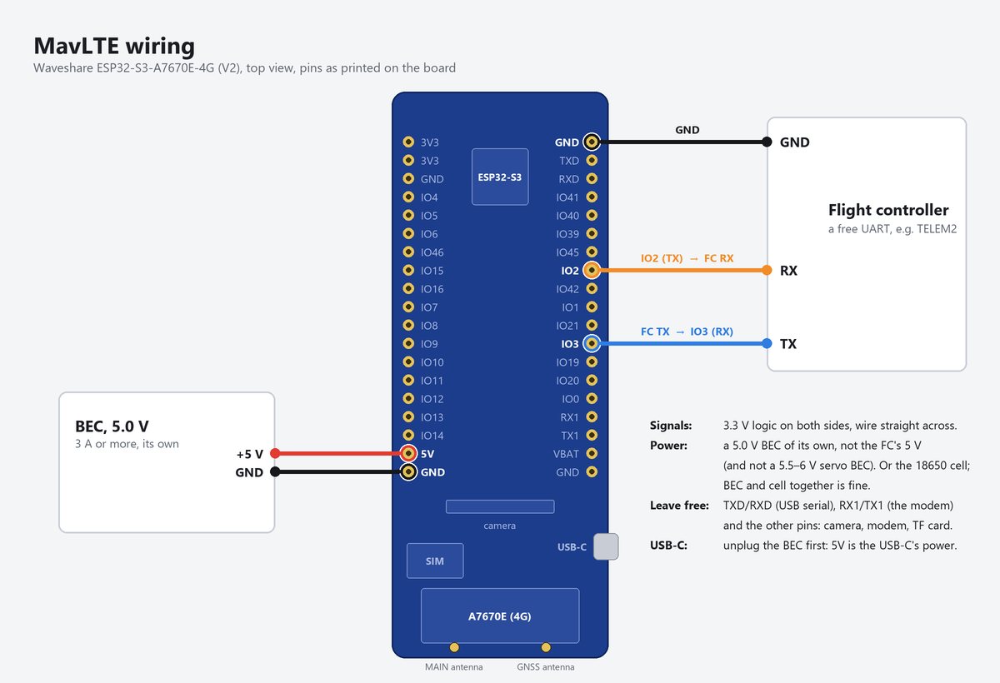

<p align="center"></p>

# MavLTE

Telemetry and command link for an ArduPilot aircraft over the mobile network, using the
Waveshare **ESP32-S3-A7670E-4G** board on the aircraft and a small relay server in the cloud.
Mission Planner (or QGroundControl) connects from anywhere with internet access, through the
MavLTE app on your laptop. A sibling of MavGCS and MavJOY.

Repository: <https://github.com/kolabuzlu/MavLTE>

```
 aircraft   flight controller ──UART── ESP32-S3 + A7670E ══ 4G ══╗
            (TELEM port)               (this firmware)           ║
                                                                 ╠══ relay server (mavrelay.py on a VPS)
 ground     Mission Planner ──UDP/TCP── MavLTE app ═ internet ═══╝
                                        (on your laptop)
```

- **Both ends dial out** to the relay, so the SIM's carrier-grade NAT and your laptop's router
  need no port forwarding.
- **MAVLink passes through untouched**: MAVLink 1, MAVLink 2 and MAVLink 2 signing all work end
  to end. The bridge only cuts the stream at frame boundaries, so a lost packet never corrupts
  neighbouring messages.
- **Authenticated tunnel**: every UDP packet carries an HMAC-SHA256 tag and a sequence number, so
  nobody can inject traffic, replay it, or divert your aircraft's downlink to themselves. The
  vehicle and the GCS side have separate keys. See [docs/PROTOCOL.md](docs/PROTOCOL.md).
- **Saves mobile data**: telemetry is batched (50 ms by default) and held back while no GCS is
  connected; it resumes within about a second when you connect.
- **Bursts arrive whole**: Mission Planner sends dozens of small messages at once at times (when a
  screen reads its parameters, say). The relay packs them into a few packets, since the aircraft's
  modem holds only about ten; a lone message still goes at once.
- **Recovers by itself** from lost coverage, modem resets, IP address changes and relay restarts.
- **Link status**: the MavLTE app shows the aircraft's signal and, on LTE, its quality, round-trip time and
  packet loss.
- **Snapshot on demand**: press *Snapshot* in the MavLTE app and the board's camera takes a photo,
  which comes to you through the relay without holding up the telemetry, with where and when it
  was taken. Only when you ask: the camera takes nothing by itself. The relay keeps photos for
  7 days, and the app collects the ones it missed when it next connects.
- **Locator**: the LTE module's own GNSS reports where the aircraft is every 5 s, whatever the
  flight controller does. After a crash that kills the flight controller, the module keeps
  reporting as long as it has power (an 18650 cell on the board), and says the flight controller
  has gone silent. The relay keeps the last known position; the app shows it on a moving map
  (satellite photos), with the track it flew.
- **Locator voice**: switch it on in the MavLTE app and the board's speaker sounds a two-tone
  alarm again and again, to find the aircraft in tall grass or crops once its position has
  brought you close. The relay keeps the switch: switched on while the aircraft is out of reach,
  it starts as soon as the aircraft is back, and the aircraft keeps sounding where it has no
  coverage.
- **On your phone**: the app's *Aircraft* panel also comes as a web page from the relay server,
  password protected, for the search with only a phone in your pocket: the link, the position
  on the moving map, the voice switch and Snapshot.
- **Flight log**: with a microSD card in the board's slot (V2 boards), a CSV line a second: the
  module's GNSS, the mobile network and its signal (cell, band, RSRP, SINR), the relay link and
  the mobile data used, the flight controller's telemetry, the board's power and what happened.
  The MavLTE app copies the files over the board's USB cable or over 4G, so the card can stay in.

| Folder | What |
|---|---|
| [firmware/](firmware) | ESP-IDF firmware for the ESP32-S3 (PlatformIO or `idf.py`) |
| [relay/](relay) | `mavrelay.py`: the relay server, the GCS agent and a Python vehicle for bench tests; `MavLTE.pyw` / `mavlte.py`: the MavLTE app (the GCS agent as a window), `build_release.py` makes it into `MavLTE.exe`; `mavweb.py` and `web/`: the app's *Aircraft* panel as a web page for a phone, on the relay server (`aircraft_card.py`: what that panel says, for both; `maptiles.py`: the app's moving map tiles); `sitl_demo.py`: the whole link with ArduPilot SITL on one PC; `PlaneSim.pyw` / `plane_sim.py`: SITL as a plane with a battery switch, a virtual LTE module with its GNSS and a backup cell, and a virtual camera |
| [docs/PROTOCOL.md](docs/PROTOCOL.md) | Tunnel protocol |

## Setup, in order

1. [Relay server](#1-relay-server) on a VPS: creates the two keys.
2. [Firmware](#2-firmware): put the relay address, the vehicle key and your APN in, build, flash.
3. [Wiring and power](#3-wiring-and-power) in the aircraft.
4. [ArduPilot parameters](#4-ardupilot-parameters) for the serial port, stream rates and MAVLink signing.
5. [MavLTE app and Mission Planner](#5-mavlte-app-and-mission-planner) on your laptop.
6. [The web page on your phone](#6-the-web-page-on-your-phone), if you like: the *Aircraft* panel
   without the laptop.
7. [The flight log](#7-the-flight-log), if you like: a microSD card in the board.

Before the board arrives you can try everything else with ArduPilot SITL on your PC, in one
command: see [Bench tests](#bench-tests).

## 1. Relay server

Any small Linux VPS with a public IPv4 address does the job (1 vCPU and 512 MB RAM is plenty).
Pick a data centre close to where you fly (Istanbul or Frankfurt from Turkey) to keep the
round trip short. It needs Python 3.8 or newer, which every current Debian and Ubuntu has.

```bash
scp -r relay you@your-server:
ssh you@your-server
cd relay && sudo sh install-server.sh
```

The installer creates `/etc/mavrelay/mavrelay.ini` with two fresh keys and **prints them**,
opens UDP port 14650 in `ufw` if it is active, and starts the `mavrelay` systemd service. If your
provider has its own firewall (security group), open **UDP 14650** there too.

- **Vehicle key** goes into the firmware.
- **GCS key** goes into the MavLTE app on your laptop.

Watch it work with `journalctl -u mavrelay -f`. Every five minutes it logs a summary, and it
logs every connection, address change and link loss as it happens.

The aircraft's photos are kept in `/var/lib/mavrelay/snapshots` for 7 days (`snapshot_dir` and
`snapshot_days` in `mavrelay.ini`), each as a `.jpg` with a `.json` beside it. Its last known
position is in `/var/lib/mavrelay/locator.json`, the locator voice switch in `voice.json` beside
it. Updating an older
relay: run the installer again, which also installs the new service file (it gives the service
that folder) and updates the web page, if you have it ([section 6](#6-the-web-page-on-your-phone));
your keys stay.

## 2. Firmware

The firmware talks to the modem over its UART (PPP on GPIO17/18, the same on both board
versions), so it does not depend on the USB DIP switch. It detects the board version by itself.

**Board versions.** V1 boards (sold until about December 2025) have an ESP32-S3R2; V2 boards
have an ESP32-S3R8, "VER 2.0" printed on the back and a different pinout. The firmware reads
the chip to tell them apart and prints `board version V1` or `V2` at start-up.

**Settings.** Open *menuconfig* (`pio run -t menuconfig`, or `idf.py menuconfig`) and go to
**MavLTE**:

| Setting | Value |
|---|---|
| Relay server | your server's name or IP address |
| Relay server UDP port | `14650` |
| Vehicle key | the vehicle key the installer printed |
| APN of the SIM card | `internet` (Turkcell, Vodafone TR and Türk Telekom) |
| SIM PIN | empty; better remove the PIN with a phone first |
| Mobile network technology | Automatic (LTE, falls back to 2G) or LTE only |
| Board version, flight controller pins | leave on detect / `-1` |
| Flight controller baud rate | `115200` |
| Locator | on, every 5 s |
| Locator: the module's satellite systems | as the modem has it (GPS + GLONASS + Galileo), or GPS + BeiDou + Galileo: BeiDou has many satellites over Asia, Turkey included, and may give a fix sooner and keep it better |
| Locator voice | on: a two-tone alarm. Or a spoken phrase, `Mav L T E here.` by default (letters and digits written apart are said one by one: a phone number written `0 5 3 2 ...` tells whoever finds the aircraft whom to call) |
| Camera | on (off, or no camera fitted: the aircraft answers that it has none); *flip photos top to bottom* and *mirror photos left to right* as the camera is mounted (both: turned 180°) |
| Flight log on the SD card | on (V2 boards; without a card the firmware runs as before) |

The rest (modem UART speed, batching, sending with no GCS connected, JPEG quality) can stay as
they are; each has a help text. PlatformIO keeps your settings, including the key, in
`firmware/sdkconfig.esp32s3-a7670e`: don't publish that file.

**Build and flash.** With PlatformIO (VS Code or the command line) in the `firmware` folder:

```bash
pio run -t upload
pio device monitor
```

Plain ESP-IDF 6.0 works too: `idf.py set-target esp32s3`, then `idf.py build flash monitor`.
The board's USB-C port goes through a USB hub to a CH343 USB-serial chip on the ESP32's UART0,
so flashing and the log use the COM port that appears on your PC. (The ESP32's own USB pins are
wired to the modem and never show up on the PC.)

**DIP switches.** Set **CAM ON** if the camera is fitted, the other three **OFF**:

| Switch | Setting |
|---|---|
| 1 CAM | ON: powers the camera (OFF: no camera, and the aircraft says so when asked for a photo) |
| 2 HUB | OFF: the USB hub and CH343 only run while USB-C is plugged in |
| 3 4G | OFF: the firmware switches the modem's power, so it can restart a modem that hangs, or one that has switched itself off (too hot, or its supply too low) |
| 4 USB | OFF: the modem's USB goes to the ESP32 (unused), not to your PC. ON only to update the modem's own firmware, or read its debug log, from a PC |

With 4G ON the modem runs anyway, but the firmware can then only reset it by AT command, which
does not reach a modem that has switched itself off; the log warns about it. On V2 boards the
camera's clock line is on GPIO46, which the ESP32 reads while it starts: if flashing ever fails
with the camera on, switch CAM off for the upload.

**The camera** (the OV5640 that comes with V2 boards, an OV2640 on V1 boards, on its 24-pin
connector) is started only when a photo is asked for and stopped once it is sent, so between
photos it uses no memory and no power. It takes about two seconds per photo, letting the
exposure settle first. The largest size (1024×768) needs about 150 KB of the ESP32's memory
while it is taken and sent; should that ever be short, the aircraft answers that the photo could
not be taken, and the smaller sizes still work.

**A healthy start** takes about 15–40 s. A V2 board with a Turkcell SIM logged this (shortened;
the relay's address and the position replaced by examples):

```
I (368) board: Waveshare ESP32-S3-A7670E-4G, board version V2
I (373) bridge: flight controller: ESP32 TX GPIO2 -> FC RX, ESP32 RX GPIO3 <- FC TX, 115200 baud; relay ...
I (385) modem: modem power on (GPIO21)
I (9221) modem: modem UART at 921600 baud
I (10260) modem: modem A7670E-FASE, firmware A7670M7_V1.11.1
I (12299) modem: registered with Turkcell, LTE, signal -59 dBm
I (12661) bridge: mobile data up, address 10.57.136.162
I (12662) bridge: relay relay.example.com is 203.0.113.10, port 14650
I (13706) bridge: connected to the relay (session 1380896e)
I (96469) modem: GNSS: 3,10,,00,00,41.1234567,N,28.9876543,E,011026,145023.00,128.6,5.516,,5.48,4.36,3.32,04
I (96469) modem: GNSS: position 41.123456, 28.987654 from 10 satellites
```

After the whole board has been without power, the GNSS starts cold: it needs half a minute or so
under open sky for its first position. When the firmware restarts only the modem, its GNSS keeps
a backup supply from the board, so it should find its position again within seconds (SIMCom
gives under 1 s for such a hot start, against under 40 s cold). The first position is also
logged as the modem wrote it: its form differs between modem firmware versions,
so that line and the modem's firmware line are worth including in a report if positions look wrong.

Once a minute the bridge logs its counters: relay state, round-trip time, bytes each way.

**The RGB LED** on the board (beside the Waveshare logo) shows the state without a laptop, from
worst to best red, yellow, purple, blue:

| LED | Meaning |
|---|---|
| red, blinking | no mobile data yet: modem starting, searching for the network |
| red | modem, SIM or network problem; the log says which (it tries again by itself) |
| yellow | mobile data up, but the relay does not answer (yet) |
| purple | connected to the relay, but the flight controller is silent: no MAVLink HEARTBEAT for 10 s (check the wiring, the baud rate and the port's protocol) |
| blue | ready to fly: the relay and the flight controller, a GCS connected or not |

At power-on it first shows each colour once, red, yellow, purple and blue, a second each (a lamp
test), while the modem starts up.

Blue proves the way *from* the flight controller (its HEARTBEATs reach the board) and the session
with the relay; it cannot see the wire the other way, from the board's TX to the flight
controller's RX. That one shows in Mission Planner: once it is connected, parameters download
and commands get their answers. The LED also takes up to 10 s to leave blue after the flight
controller or the relay falls silent.

The board's other lights are not the firmware's: the blue one is power, and the red one at the
antenna end is the modem's own network light (steady while it searches, flashing once
registered). The red part at the top, beside the logo, is the ESP32's ceramic antenna, not a light.

## 3. Wiring and power

**Flight controller.** Use a free TELEM port. Both sides use 3.3 V logic, so wire directly:

| Signal | V1 board | V2 board |
|---|---|---|
| ESP32 TX → flight controller RX | **IO41** | **IO2** |
| ESP32 RX ← flight controller TX | **IO42** | **IO3** |
| Ground | GND | GND |



The pins are labelled on the board. Do not connect the flight controller's 5 V pin. The pin
headers may come loose in the box and need soldering. If you need other pins, set them in
menuconfig; never use GPIO17/18 (the modem's UART, also on header pins 32 and 34: connect nothing
there), 40 and 45 (the modem's RI and DTR), 43/44 (USB-serial), 46 (V1: the TF card, V2: the
camera) or, on V1, GPIO33 and on V2, GPIO21 (modem power).

**Power.** The modem draws current peaks of up to 2 A, so do not run the board from the
flight controller. Either:

- feed **5 V from its own BEC (3 A or more)** into the header's **5V** pin. The modem's
  transmitter takes up to 2 A in short bursts, and the board's charger up to 2 A more while it
  charges the cell. Take a 5.0 V BEC, not a 5.5–6 V servo BEC: on V2 boards the 5V pin also
  feeds the modem's USB supply, rated for 5.4 V at most. Or
- run it from an **18650 cell** in the holder: it also keeps the link alive if the flight
  battery fails. Both together work as well; the BEC then charges the cell. With both, the
  **locator** keeps working after a crash that disconnects or destroys the flight battery: the
  module reports its position on the cell for many hours, and the cell's charge from the board's
  fuel gauge. Running on USB and the cell at once does the board no harm: it runs from USB and
  charges the cell on the side (up to 2 A, to 4.2 V, then it stops), and when USB goes the cell
  takes over without a break. On V2 boards the gauge measures the board's supply rail, not the
  cell: while USB or the BEC powers the board, the rail is about 4.3 V, which MavLTE shows as
  *external power*; on the cell alone, it is the cell. The charge comes from the cell's voltage:
  4.20 V is 100 % and 3.40 V is 0 % (the modem's lowest supply: below it, the module stops), along
  a Li-ion cell's curve, which stays flat through the middle and falls fast near empty: 4.0 V is
  79 %, 3.8 V 55 %, 3.7 V 38 %, 3.6 V 21 %, 3.5 V 6 %. The gauge shares the camera's bus, whose
  pull-up resistors take their power from the camera: with DIP switch CAM off, it does not answer.

The bursts are strongest on 2G (GSM/EDGE), and the board has less buffer capacitance on the
modem's supply than SIMCom asks for: keep the supply wires short and thick, and where LTE
coverage is good, or when the board runs on its cell alone, choose *LTE only* in menuconfig.

The 5V pin is wired straight to the USB-C port's power line. Unplug the BEC (or the flight
battery) before you connect USB-C to a PC.

**Heat.** The ESP32-S3R8 of V2 boards is rated for at most 65 °C of air around it (V1's
ESP32-S3R2: 85 °C), and a closed fuselage parked in the summer sun gets that hot. The modem is
rated for −30…+80 °C, warns beyond that and switches itself off above 85 °C; with DIP switch 4G
off the firmware keeps restarting it, and it comes back once it has cooled down. Its own
transmitter heats it further. Give the board some airflow, away from the motor and its ESC, and
keep the aircraft in the shade on the ground. The module sends its chip's temperature with every
position report and MavLTE shows it under *Module*. The chip reads warmer than the air around it
(it heats itself, and the modem beside it heats the board), so take amber (70 °C) as a sign that
the board is getting hot, and red (80 °C) as a sign to cool it down. The board charges its 18650
cell whenever it has 5 V, without measuring the cell's temperature, while Li-ion cells are meant
to be charged below about 45 °C: on a hot day, keep the aircraft in the shade, or charge the
cell outside it.

**Antennas and SIM.** Screw the LTE antenna onto the modem's main antenna connector, and the
GNSS antenna (the small ceramic patch) onto the board's GNSS connector, for the locator: mount it
flat, facing the sky, away from the LTE antenna. Insert a nano-SIM with a data plan, PIN removed.

**Radio.** The ESP32's own Wi-Fi and Bluetooth are off for good: the firmware never starts them,
and it is built without the libraries that could (`CONFIG_APP_NO_BLOBS`). So the board sends
nothing on 2.4 GHz, where ELRS and many video links work; its only transmitter is the LTE
modem. Mount the LTE antenna as far as the airframe allows from the RC receiver's antennas and
from the flight controller's GPS.

**Camera.** It sits on the board's own connector, so it needs no wiring. Mount the board (or the
camera on an extension cable) looking where you want your photos, away from the propeller. If the
photos come upside down or mirrored, switch on *Camera: flip photos top to bottom* and/or *Camera:
mirror photos left to right* in menuconfig (both together turn them 180°): the camera then does
it itself, at no cost.

**Speaker**, for the locator voice: the small speaker that comes with the board, on its speaker
header. The header is wired straight to the modem's earpiece output (V2 schematic: no amplifier
on the board), so it is loud enough for the last metres to the aircraft, not to be heard across
a field. Mount it where the fuselage does not muffle it: behind an opening, or under a thin
covering.

## 4. ArduPilot parameters

The examples use TELEM2, which is `SERIAL2`; use the number of the port you wired.

| Parameter | Value | Why |
|---|---|---|
| `SERIAL2_PROTOCOL` | `2` | MAVLink 2, which signing needs |
| `SERIAL2_BAUD` | `115` | 115200 baud, same as the firmware setting |
| `BRD_SER2_RTSCTS` | `0` | no flow-control wires (only on ports that have RTS/CTS) |
| `SERIAL2_OPTIONS` | add `4096` (bit 12, "Ignore Streamrate") | ArduPilot 4.6 and older: stops Mission Planner from raising the data rates below when it connects |
| `MAVn_OPTIONS` | add `4` (bit 2) | the same for ArduPilot 4.7 and newer |
| `FS_GCS_ENABL` | `0` | no GCS failsafe on 4G dropouts while ELRS is your main link |

**Stream rates.** Mobile data is paid by the byte, so ask for what you actually look at. The
stream rate parameters are numbered by MAVLink port, not by serial port: port 0 is USB, then
every serial port with a MAVLink protocol counts up in order. If `SERIAL1` is your ELRS receiver
(protocol 23) and `SERIAL2` is the 4G bridge, the bridge is MAVLink port 1: `SR1_*` in ArduPilot
4.6 and older, `MAV2_*` in 4.7 and newer (the new names count from 1). When in doubt, search
the parameter list for `SR` or `MAV` and look at which port's rates Mission Planner changed.
**ArduPilot reads these rates only when it starts: reboot the flight controller after setting
them.** On 4.7 and newer use only `MAVn_OPTIONS` for "Ignore Streamrate"; a prearm check
complains if the old `SERIALn_OPTIONS` bit is still set.

| Group | Rate (Hz) | Gives you |
|---|---|---|
| `EXTRA1` | 4 | attitude for the HUD |
| `POSITION` | 2 | position on the map |
| `EXTRA2` | 2 | airspeed, altitude, climb, throttle |
| `EXT_STAT` | 1 | battery, GPS, mission progress, system status |
| `EXTRA3` | 1 | wind, EKF status, vibration |
| `RAW_SENS`, `RC_CHAN`, `RAW_CTRL`, `ADSB` | 0 | raw sensors, RC and servo values, ADS-B |

**MAVLink signing.** The relay only lets your own vehicle and MavLTE app in, but signing is what
guarantees that only your Mission Planner can command the aircraft, whatever happens on the
network. Connect the flight controller by USB, open *SETUP → Advanced → MAVLink Signing*, press
*ADD* to create a key and *USE* to put it on the flight controller. Mission Planner keeps the key
and signs everything it sends. The flight controller then ignores unsigned commands on
`SERIAL2`. USB is exempt, so you cannot lock yourself out.

## 5. MavLTE app and Mission Planner

**The MavLTE app.** On Windows, run **`MavLTE.exe`**: one file, no Python needed (to make it, see
[Development](#development)). With Python 3 (python.org) it also runs from the `relay` folder:
double-click **`MavLTE.pyw`** or run `python mavlte.py`. The first time it asks for the relay
server and the GCS key (later: ☰ → Settings). Both switches start off. Then:

- Switch **UDP** on to send to Mission Planner on 127.0.0.1:14550, and/or **TCP** to listen on
  127.0.0.1:5760. Change a port while its switch is off.
- Each card has two **LEDs**. **Available** (green, on the left) lights while the aircraft's LTE
  module is online at the relay, even with the switches off. **Connected** (blue, next to the
  switch) lights while it is online and that port is on. The bars show its 4G signal: its
  strength and, on LTE, its quality (SINR), whichever is lower. The header shows the link to
  the relay, the *Aircraft* panel the aircraft's link (signal, quality and round trip), packet
  loss and traffic, and ☰ → Show log the details, in a window of its own. In the air the
  signal stays strong while the quality falls, as the modem hears many cells at once, and the
  link falls with the quality: the *Link* line turns amber where drops are likely (-9 to -12 dB),
  red where the link fails (-13 dB and below). On the first flight it held to about 500 m above
  home all but a few seconds, and failed for minutes at 1000 m.
- In Mission Planner pick **UDP**, port **14550**, or **TCP**, host **127.0.0.1**, port **5760**.
  QGroundControl finds UDP 14550 by itself.
- **From another computer, a tablet or a phone** on the same network: switch the port off, set
  its IP to **0.0.0.0** and switch it on again. It then listens on all of this PC's addresses,
  and the card shows the one to use (192.168.2.178, say). **TCP**: connect to that address and
  port. **UDP**: in Mission Planner pick **UDPCl** and enter that address and port; in
  QGroundControl add a UDP comm link with that address and port as its server. Several can
  connect at once. Or put the other computer's own address on the UDP card: MavLTE then sends
  there, to Mission Planner listening on UDP (14550). Anyone on that network can reach the
  aircraft through a port open like this, so do it only on networks you trust (with MAVLink
  signing, above, the flight controller ignores commands that are not signed).
- With both switches off the app only watches: the Available LEDs keep working, but the aircraft
  holds its telemetry back, so it uses almost no mobile data.
- **Position**, in the *Aircraft* panel, is where the LTE module's own GNSS puts the aircraft,
  live every 5 s, whatever the switches. **Copy** puts the coordinates on the clipboard. With the
  aircraft offline, it shows the last known position and how long ago that was (in amber): the
  relay keeps it, so the app shows it even when it was closed at the time. **Map** opens the
  moving map: the aircraft on satellite photos (Esri World Imagery), green while it reports and
  amber where it was last known, an arrow when it moves, with the track it flew since the app
  started. It follows the aircraft until you drag the map; the wheel or **−** and **+** zoom, and
  **Follow** brings it back. **Google Maps** there opens the position in the browser (with
  directions, on a phone). The map's tiles come from Esri over this computer's internet,
  about 15–40 KB each. **Module** says whether the flight controller still
  talks to the module, in red when it has gone silent (a crash, say) while the module still
  reports, its power: *external power* (USB or the BEC) or, on its own cell, the cell's charge
  and voltage, as `battery 78%, 3.95 V` (after a crash that took the flight battery: the log says
  when it changes), and the
  temperature of its ESP32-S3 chip: in amber from 70 °C, in red from 80 °C (see *Heat* in
  section 3).
- **Voice**, the locator voice, in the *Aircraft* panel: switched on, the speaker on the
  aircraft's board sounds a two-tone alarm (beeps of 2.4 and 3 kHz in turn) until you switch it
  off, to find the aircraft in the last metres once *Position* has brought you close. The relay
  keeps the switch, so it also works with the aircraft offline: switched on while it is out of
  reach, the aircraft starts sounding as soon as it is back; switched on before it lost coverage,
  it keeps sounding. Beside the switch: sounding (green), sounding when last heard (amber), or
  that it cannot play it (red: its modem refuses). A second MavLTE, on another laptop, shows the
  same switch.
- **Snapshot**, at the bottom of the *Aircraft* panel, asks the aircraft for a photo, whatever the
  switches: pick **Small** (320×240, about 5–10 KB), **Medium** (640×480, 10–30 KB) or **Large**
  (1024×768, 25–80 KB) beside it. The line below shows the photo arriving; it then opens in a
  viewer with when it was taken, the position, the altitude above home and the heading (arrow
  keys: older and newer photos). The thumbnail opens the last one again.
- Photos go to **Pictures\MavLTE** (`photo_dir` in `mavrelay.ini` to change it), named by date
  and time, each with a `.json` beside it holding the same notes. Photos taken while the app was
  closed (asked for from another laptop, say) arrive by themselves when it connects.
- **☰ → Flight logs** copies the aircraft's flight log (see [section 7](#7-the-flight-log)).

The app keeps its settings in the `[gcs]` section of `mavrelay.ini`: `MavLTE.exe` in
`%LOCALAPPDATA%\MavLTE\mavrelay.ini` (or in a `mavrelay.ini` next to the exe, if you put one
there, to carry it on a USB stick); from source, the one next to `mavlte.py`.

**Without the window**, the same agent runs on the command line (Python 3 and the `relay` folder)
with the same file: double-click `start-gcs.bat`, or run

```bash
python mavrelay.py gcs --server your-server.example.com:14650 --key <GCS key>
```

and the agent reports the link to the relay and the aircraft as text:

```
2026-09-30 14:02:11 INFO    connected to server 203.0.113.10:14650 (session 5c1e0a77)
2026-09-30 14:02:12 INFO    vehicle: online, LTE -71 dBm, quality 11 dB, rtt to server 64 ms, loss up 0.0% down 0.0%; GNSS 41.123457, 28.987654 (9 satellites, 3 s ago)
```

The agent talks UDP to the relay, so a lost packet on a patchy laptop connection (a phone
hotspot in the field, say) does not stall everything behind it the way TCP would.

**Without the agent.** The relay can also offer a plain TCP port for Mission Planner
(`tcp_listen` in `mavrelay.ini`). Traffic on it is not authenticated, so by default only the
server itself may connect: reach it through an SSH tunnel,
`ssh -N -L 5760:127.0.0.1:5760 you@your-server`, then connect Mission Planner to TCP
127.0.0.1:5760. To open it to fixed addresses instead, list them in `tcp_allow`.

## 6. The web page on your phone

The app's *Aircraft* panel also comes as a web page, for when you go looking for the aircraft with
only a phone: its link and signal, **Position** with **Map** and **Copy**, **Module**, the
**Voice** switch, and **Snapshot** with the last photo (tap it for the whole screen, swipe for the
ones before). It says what the app says, in the same colours. It runs on the relay server, so no
laptop has to be on. Telemetry stays with Mission Planner: the page has none.

**Map** opens the moving map on the whole screen, as in the app, with the track the page's server
kept (the last three hours or so, also while no phone looked): drag it, pinch or **−** and **+**
to zoom, **Follow** to come back to the aircraft. **Google Maps** opens the Maps app with the
position, to be guided there.

```bash
cd relay && sudo sh install-web.sh 203-0-113-10.sslip.io
```

with your server's address in that name, dashes for dots ([sslip.io](https://sslip.io) turns the
name back into the address, so no domain is needed), or a name of your own that points at the
server. The script runs `mavweb` as a service beside the relay, and puts
[Caddy](https://caddyserver.com) in front of it for HTTPS: Caddy takes TCP ports **80 and 443**
(open them in your provider's firewall, if it has one) and gets the certificate from Let's Encrypt
by itself. The first run asks for the page's **password** (run without a terminal, it makes one
up and prints it).

Open `https://203-0-113-10.sslip.io` on the phone and sign in: the phone stays signed in, for 180
days after its last visit. Add it to the home screen (browser menu → *Add to Home screen*) and it
opens like an app.

- **A new password:** `sudo python3 /opt/mavrelay/mavweb.py password` (`--random` makes one up);
  every phone signs in again, so it is also the way to shut out a lost phone. After 5 wrong
  passwords from one address in 10 minutes, or 30 from all addresses together, signing in waits
  10 minutes; phones already signed in go on as before.
- The page is a GCS agent that only watches, like the app with both switches off, so it costs the
  aircraft no mobile data. Photos asked for on the phone also come to the MavLTE app, and the
  other way round; the page keeps the newest 200 (in `/var/lib/mavrelay/web-photos`).
- `journalctl -u mavweb -f` logs sign-ins (with the phone's address) and every switch of the
  voice and photo asked for on the page. Its settings, in `[web]` in `/etc/mavrelay/mavrelay.ini`
  (then `sudo systemctl restart mavweb`): `name`, the aircraft's name on the page; `photo_dir`;
  `listen`, 127.0.0.1:8090, which only Caddy needs to reach.

## 7. The flight log

With a microSD card in its TF slot, a V2 board writes what it knows to the card once a second, as
CSV, from power-on to power-off: one file per power-on, `MAVLTE/LOG00001.CSV`, `LOG00002.CSV` and
so on (a new one after every 16 MB, about 14 hours). An hour takes about 1.3 MB, so a card lasts
for years; the board never deletes anything and never formats a card. It saves the file every 5
seconds, so a power cut loses at most the last 5 seconds.

**The card** must be FAT32: the board cannot read exFAT, which cards over 32 GB come with, and
Windows' own formatting offers FAT32 only up to 32 GB. Format a larger card with a FAT32 tool
(any cluster size; 32 KB is fine); a 256 GB card works. The board looks for a card every 30
seconds, so it can also go in while the board runs. V1 boards wire their TF slot differently and
log nothing.

**Copying the files.** In the MavLTE app, **☰ → Flight logs**: the files on the card, newest
first, with when each began, how long it ran and its size. **Download** copies the ones
selected (the newest if none is) into **Documents\MavLTE\Logs**, named by when they began
(`2026-10-02 12-35 LOG00012.csv`); a copy that stopped short, or of a file that has grown since,
goes on from where it ends. **Folder** shows the copies. *From*:

- **4G**, through the relay, from wherever the aircraft is: at up to 32 KB/s on LTE (2 KB/s on
  2G), never while a photo goes, and only as fast as the link carries without holding up the
  telemetry: a one-hour file takes about a minute on LTE. It needs firmware and relay 1.8.0.
- **USB cable**, from the board's USB-C socket, the one it is flashed through: at about 65 KB/s,
  a one-hour file in about 20 seconds, while the board runs on. **Unplug the BEC first**: USB-C
  and the board's 5V pin are one supply. The app finds the board by itself; while it talks to it,
  the board's own log on that port stays quiet, so a serial monitor cannot use the port then.

**What a line holds** (an empty field: not known, or older than 5 seconds):

| Columns | What |
|---|---|
| `time_utc`, `uptime_s` | UTC time, once the board has it (from the module's GNSS, or the relay's clock when it connects); seconds since power-on |
| `gnss_fix`, `gnss_sats`, `gnss_lat`, `gnss_lon`, `gnss_alt_m`, `gnss_speed_ms`, `gnss_course`, `gnss_hdop`, `gnss_age_s` | The LTE module's own GNSS (the locator): fix (0 none, 2 2D, 3 3D), satellites, position, altitude above sea level, speed, course, HDOP, age of the reading |
| `net`, `signal_dbm`, `operator`, `plmn`, `band`, `cell_id`, `rsrp_dbm`, `rsrq_db`, `rssi_dbm`, `sinr_db` | The mobile network: LTE, GSM or NO SERVICE, the signal (AT+CSQ), the operator and its MCC-MNC, the band (`B3`), the serving cell, and on LTE its RSRP, RSRQ, RSSI and SINR |
| `relay`, `rtt_ms`, `loss_pct`, `data_kb`, `gcs` | Connected to the relay (1/0), round-trip time, downlink packet loss, mobile data used since power-on (with the IP and UDP headers your plan counts), a GCS connected |
| `fc_heard_s`, `fc_mode`, `fc_armed`, `fc_gps_fix`, `fc_gps_sats`, `fc_lat`, `fc_lon`, `fc_alt_m`, `fc_rel_alt_m`, `fc_heading`, `fc_groundspeed_ms`, `fc_airspeed_ms`, `fc_climb_ms`, `fc_throttle`, `fc_battery_v`, `fc_current_a`, `fc_battery_pct`, `fc_rssi` | The flight controller, from its MAVLink: seconds since its last HEARTBEAT, flight mode (ArduPlane's names), armed, its GPS fix and satellites, position, altitude above sea level and above home, heading, ground speed, airspeed, climb rate, throttle, battery voltage, current and remaining, RC signal (0–254). The messages come at the stream rates of [section 4](#4-ardupilot-parameters) |
| `chip_c`, `power`, `cell_pct`, `rail_mv` | The ESP32-S3's temperature, the board's power (`ext`: USB or the BEC; `cell`: its 18650), the cell's charge, the rail's voltage |
| `voice`, `events` | The locator voice (`off`, `on`, `sounding`, `cannot`); what happened in that second: `relay connected; photo 1790933700 sent`, the reason for a restart (`brownout`, `watchdog`) in the first line |

It is the link's own record, beside the flight controller's dataflash log, not instead of it:
open it in a spreadsheet, or plot it with the coverage along the flight.

## Bench tests

**The whole link with SITL, on one PC.** `sitl_demo.py` starts ArduPilot SITL (Mission Planner's
copy) as the flight controller, `mavrelay.py vehicle` in place of the ESP32, a relay and the GCS
agent, and can make the link between vehicle and relay behave like a poor mobile connection:

```bash
cd relay
python sitl_demo.py                                # clean link
python sitl_demo.py --delay 80 --jitter 30 --loss 3   # 80 ± 30 ms each way, 3% packets lost
```

Close Mission Planner's own simulation first (it uses the same ports). In Mission Planner, choose
**UDP**, click Connect and accept port **14550**: you now see and command the simulated plane only
through the tunnel, as you will in the aircraft. Arm it, fly a mission, change modes. Every 10 s
the demo prints the mobile data the link would use.

**With the MavLTE app**, as you will fly: start `python sitl_demo.py --no-agent`, then
double-click `MavLTE.pyw` and switch UDP or TCP on. The demo puts its relay (127.0.0.1:14650)
and a key into `mavrelay.ini`, so the app connects without any setup. The demo also prints a
command line for the text agent.

The plane's "USB port" (SITL `SERIAL0`) is TCP 127.0.0.1:5780, which you can use to set up MAVLink
signing first, just like over USB on the real flight controller.

**Through your real relay server**, the SITL plane connects exactly as the ESP32 will, and the
MavLTE app connects to the same server:

```bash
python sitl_demo.py --server your-server:14650 --no-agent
```

It takes the vehicle key from the `[vehicle]` section of `mavrelay.ini` (`key = <vehicle key>`)
or from `--vehicle-key`. Give the MavLTE app the server and the GCS key.

**SITL through the real board**, before a flight controller is wired: SITL plays the flight
controller of the real board, over its USB-C cable, and everything after it is real (the mobile
network, your relay, the MavLTE app). It needs a bench build of the firmware that listens for
the flight controller on the USB-serial pins: in menuconfig set the flight controller pins to
**TX 43, RX 44**, then build and flash. The board's log stops on the USB port as soon as the
firmware starts (those pins now carry MAVLink), and flashing works as always. Then, with the
plane simulator closed (it uses the same SITL ports):

```bash
python sitl_demo.py --board COM9
```

with the board's COM port. Open the MavLTE app, switch UDP or TCP on and connect Mission Planner
to it: the module reports "flight controller talking", and you fly the SITL plane through the
board. **A bench build must not fly:** set the pins back to `-1` and flash again before you wire
the real flight controller.

**MavLTE Plane Simulator.** The same, as a window with the plane's power switches, both off at
the start: double-click `PlaneSim.pyw` (or run `python plane_sim.py`). It uses the `[vehicle]`
section of `mavrelay.ini`.

- **Battery** powers the whole plane: on starts SITL, off stops it at once.
- **LTE module** is the modem. On, it starts up like the real one (about 16 s, or a couple of
  seconds with *Quick start*); off cuts it without a goodbye, as a power cut would. Its LED
  shows what the board's RGB LED shows.
- **Network** is what the plane flies through. The A7670E falls back to 2G where there is no LTE;
  it has no 3G, so where an operator offers only 3G it is on 2G. The figures are for an aircraft,
  which fares worse than a phone on the ground: above the rooftops it sees many cells at once, so
  interference is high and handovers frequent (3GPP TR 36.777). With an excellent signal:

  | Network | Upload | Delay added each way | Loss | MavLTE shows |
  |---|---|---|---|---|
  | No connection | none | | all | no signal |
  | 2G (EDGE) | 40 kbit/s | 300 ms ± 150 | 2% | EDGE |
  | LTE (4G) | 2 Mbit/s | 30 ms ± 20 | 0.5% | LTE |

  On top of that come the troubles that make a real link patchy, at random. With a good signal:

  | | 2G (EDGE) | LTE (4G) |
  |---|---|---|
  | Latency spike | every ~20 s, 1–4 s, +0.5–2 s | every ~30 s, 1–3 s, +0.2–1 s |
  | Fade (packets lost) | every ~45 s, 0.5–2 s, half | every ~60 s, 0.3–1.5 s, 40% |
  | Cell change | every ~60 s, 1.5–4 s without data | handover every ~30 s, 50–150 ms held back |
  | Dropout | every ~5 min, 5–15 s | every ~5 min, 2–8 s |

  Changing between 2G and LTE costs a few seconds without data, as on a real modem.
- **Signal**, from *Weak* to *Excellent* (default *Good*), is the level the module reports (the
  bars in MavLTE). A weaker signal slows the link and adds delay and loss, and makes the troubles
  more frequent and longer: twice with *Fair*, four times with *Weak*, half with *Excellent*. From
  *Fair* down, 2G is slower than the telemetry, so it queues up and the *Data* line shows packets
  being lost.
- **Camera** is the board's camera with its CAM switch: *Snapshot* in MavLTE gets a picture of sky
  and fields as the SITL plane flies, rolls and pitches, with the plane's position, of the size a
  real one would be, sent the way the firmware sends it. Off, the aircraft answers that it has no
  camera. With the telemetry flowing, a medium photo takes about 3 s on LTE; on 2G from half a
  minute (excellent signal) to two or three minutes (fair), as the photo only takes what the
  telemetry leaves. With a weak 2G signal even the telemetry does not fit, and a photo hardly
  gets through.
- **GPS** is the module's own GNSS: its first position about 25 s after the module powers on
  (3 s with *Quick start*), then where the SITL plane is, within a few metres.
- **Backup cell** is an 18650 cell in the board's holder. With it in, switch the **Battery**
  off in flight to stage a crash: the flight controller dies, the module runs on and keeps
  reporting where the plane came down, and MavLTE shows the flight controller silent (red).
  Take the cell out as well, and the plane is gone: MavLTE keeps its last known position.
- **Voice** shows what the board's speaker would be playing when MavLTE's *Voice* switch is on,
  also with *No connection*: a module that was switched on keeps sounding.
- The module's chip temperature (top right of its panel) follows the air in the fuselage plus
  its own heat. **In the sun** heats the fuselage to 65 °C: within a minute or two MavLTE shows
  the chip in amber, then in red.

Put the MavLTE app beside it and watch its LEDs follow: they go dark about 3 s after the plane
goes quiet.

**Real flight controller on USB.** `mavrelay.py vehicle` does in Python what the ESP32 does:
`python mavrelay.py vehicle --server your-server:14650 --key <vehicle key> --serial COM5:115200`
(needs `pip install pyserial`).

## Mobile data

Measured with ArduPlane 4.8 SITL through the tunnel (`sitl_demo.py` prints these numbers), counting
IP and UDP headers the way a mobile operator bills them:

| ArduPilot sends | Signing | Mobile data |
|---|---|---|
| the stream rates above (with "Ignore Streamrate") | on | **about 8 MB per hour** |
| the stream rates above | off | about 7 MB per hour |
| what Mission Planner asks for (all streams at 4 Hz) | on | about 24 MB per hour |

A full parameter download is about 0.1 MB. While no MavLTE app (or agent) is connected, the aircraft sends
no telemetry, only the link check (about 0.5 MB per hour) and the locator's position every 5 s
(about 65 KB per hour). A longer batch interval saves header bytes at the cost of telemetry
delay; commands from the GCS are never delayed.

A photo costs its size plus about 6%: roughly 10 KB small, 25 KB medium, 60 KB large. Only the
aircraft's uplink counts; photos coming again from the relay (to a second laptop, or ones
missed while the app was closed) travel over your laptop's internet.

## In the aircraft

- **Keep ELRS as the primary link.** Expect 50–150 ms latency, multi-second gaps at cell
  handovers and patchier coverage at altitude. Use 4G for telemetry, mode changes and missions,
  not for stick control.
- **Range check.** Do an ELRS range check with the modem connected and transmitting. Keep the
  LTE antenna away from the RC receiver's antennas and from the GPS.
- **Wi-Fi and Bluetooth** stay off: the firmware never starts them, so they cannot interfere with
  2.4 GHz ELRS.

## Troubleshooting

| Symptom | Look at |
|---|---|
| MavLTE says the aircraft is not connected to the relay | The ESP32 log (`pio device monitor`): SIM, network registration, APN, relay address and key. |
| ESP32 log shows `Vehicle key is not set` | Set it in menuconfig, rebuild and flash. |
| `the modem does not answer on its UART` | Modem power: the 5 V supply, and whether the DIP switch or firmware turns the modem on. |
| `the modem does not answer at 921600 baud` | The board's modem link cannot carry the fast rate; the firmware stays at 115200 until the next power-on, which is enough for telemetry. With DIP switch "4G" on, it stays at 115200 for good (the firmware cannot restart the modem then): power the board off and on once, and to try the fast rate again, erase the flash (`pio run -t erase`) and upload. |
| `the modem does not take CMUX` | Data calls go without the multiplexer until the next power-on, so no GNSS positions and no locator voice during them. It is tried again at every power-on. |
| `relay silent with the network there: redialling` (flight log) | The modem had the network and a signal, but nothing came from the relay for a minute: the data call is redialled once (a few seconds), which cures a mobile data connection that stalled after a gap in coverage. If the relay stays silent, it redials again after 3 minutes, and the second time resets the modem. |
| `no usable SIM card` / `needs a PIN` / `locked (PUK needed)` / `rejected the PIN` | SIM seated contacts-down; remove the PIN with a phone. If the SIM rejects the PIN from menuconfig, the firmware remembers that and does not send it again, not even after a restart, so it cannot lock your SIM. It tries again once the PIN in menuconfig changes or the SIM has been unlocked in a phone. |
| `searching for the network (no signal yet ...)` | LTE antenna on the main connector; coverage. |
| `the network refused registration` | The SIM is not activated or has no data plan. |
| `no IP address from the network` | Wrong APN. |
| Relay log says `... has the wrong key` | The key in the firmware (or agent) differs from `vehicle_key` (or `gcs_key`) in `mavrelay.ini`. |
| Relay log is silent when the aircraft is on | The UDP port is closed in a firewall, or the host or port in the firmware is wrong. |
| In the air the link drops for seconds or minutes, though MavLTE showed a strong signal | The signal's *quality* fell, not its strength: up there the modem hears many cells at once, and they drown each other out. MavLTE's *Link* line shows the quality (SINR) and turns amber, then red, before the link fails; the bars follow it. On the first flight the link held down to -9 dB and failed below -12 dB, which came above about 500 m over home; the modem falls back to 2G (EDGE) only where LTE fades out altogether. Fly lower, or expect the gaps: MavLTE reconnects by itself. |
| Agent connects, Mission Planner shows nothing | Mission Planner's port must match `--udp` (default 14550). Check `SERIALn_PROTOCOL` and `SERIALn_BAUD`, and that TX and RX are crossed. |
| Another computer or phone cannot connect | The MavLTE card's IP must be 0.0.0.0 ([section 5](#5-mavlte-app-and-mission-planner)); for UDP, Mission Planner there connects with UDPCl, not UDP. The first time a port listens, Windows asks whether to let MavLTE through its firewall: tick the kind of network you are on (Windows often calls a home Wi-Fi *Public*). |
| Mission Planner connects but commands are ignored | Signing is on and this Mission Planner does not have the key. |
| Now and then a command or parameter read gets no answer (Mission Planner asks again) | The flight controller lost it on its serial port; everything reaches its pins. In Mission Planner, *Config → MAVFtp → @SYS → uarts.txt*: the bridge's port (`SERIALn`) shows `OE` (overrun) or `NE` (noise) above 0, and no `*` after `RX`, which means it receives without DMA. A flight controller that stops for a moment then loses what arrives meanwhile. Seen here: a SpeedyBee F405 WING (ArduPlane 4.7.1) stopped for half a second every 76 s while disarmed, and about 1 message in 300 from Mission Planner was lost on its SERIAL2. A port with `RX*` avoids it; on that board the only one is SERIAL1, the RC input, best left to the receiver. |
| MavLTE says it cannot read its settings file | A line in `mavrelay.ini` it cannot make sense of, or the file saved in an encoding other than UTF-8; the message names the line. Fix it, or delete the file (`%LOCALAPPDATA%\MavLTE\mavrelay.ini` for `MavLTE.exe`) and enter the relay and key again. |
| Data use higher than expected | Mission Planner raised the stream rates: set the "Ignore Streamrate" option and the rates, then reboot the flight controller. |
| `No photo: the aircraft has no camera` | DIP switch CAM on, the camera's ribbon cable seated in its connector (contacts the right way round), *Camera* on in menuconfig. The ESP32 log says why. |
| `No photo: the camera could not take the photo` | The ESP32 log says why; for *Large*, too little free memory: take *Medium*. |
| Photos have no position in their notes | The flight controller sends no `GLOBAL_POSITION_INT` on the bridge's port: set the `POSITION` stream rate (see above). |
| MavLTE shows the module's chip temperature in amber or red | The board is too warm: in the sun, or without airflow (see *Heat* in section 3). Above 65 °C of air around it, V2 boards are outside their chip's rating. |
| Position says `GNSS searching` for minutes | The GNSS antenna on the board's GNSS connector, flat and with open sky above it; not under carbon fibre or metal. Indoors it hardly ever gets a fix. |
| Position says `the LTE module cannot read its GNSS` | The modem did not take its multiplexer (CMUX), which reading the GNSS during the data call needs; the ESP32 log says so. The link works without it. To try again: erase the flash (`pio run -t erase`) and upload. |
| MavLTE's *Voice*: `On, but the aircraft cannot play it` | The modem refuses to play the alarm (`AT+CCMXPLAY`; the firmware stores it in the modem's flash first and logs whether that worked) or the phrase (`AT+CTTS`), or did not take its multiplexer (CMUX), which the voice needs during the data call like the GNSS; the ESP32 log says which. Tried and heard on an A7670E-FASE with modem firmware A7670M7_V1.11.1. |
| MavLTE's *Voice*: `On, but no answer: firmware before 1.5.0?` | The aircraft's firmware is older than 1.5.0: update it. |
| *Voice* says the aircraft's speaker is sounding, but nothing to hear | The speaker plugged into the board's speaker header; the fuselage muffling it (see *Speaker* in section 3). |
| The web page does not open, or the browser warns about its certificate | TCP ports 80 and 443 open in the provider's firewall; the name points at the server. `journalctl -u caddy` says whether Let's Encrypt gave the certificate. |
| The web page says `No connection to the server` | The phone's own internet; it tries again by itself. If other sites work, `systemctl status mavweb` on the server. |
| *Flight logs*: `the aircraft has no SD card it can read` | A card in the TF slot, formatted FAT32 (not exFAT); the ESP32 log says what it found. |
| *Flight logs*: `No MavLTE board on a USB port` | The board's USB-C to this computer with a data cable (some are charge-only); firmware 1.8.0 or later. Close any serial monitor on its port. |
| *Flight logs* over 4G: `no answer from the aircraft (firmware before 1.8.0?)` | The aircraft's firmware or the relay is older than 1.8.0: update both. |
| The moving map stays black | The map's satellite photos come from Esri (server.arcgisonline.com) over the laptop's or phone's own internet. MavLTE's log says `cannot load the map's tiles from Esri` and why; it tries again after half a minute. |

## Development

```bash
cd relay && python -m unittest discover -s tests       # relay, protocol, end-to-end over UDP
cd firmware/test/host && make test                      # C core: SHA-256/HMAC, framing, tunnel, snapshots, positions, GNSS
```

On Linux, macOS or WSL the relay tests also build `firmware/test/host/tunnel_harness` and run the
firmware's C tunnel code against the Python relay, including a relay restart, and have it send a
photo and its GNSS position to a Python GCS agent.

**One version number for everything:** the firmware (`firmware/main/version.h`) and the app,
simulator and relay (`__version__` in `relay/mavrelay.py`) always carry the same number; a test
fails if they differ.

**MavLTE.exe** (on Windows, with `pip install pyinstaller`):

```bash
cd relay && python build_release.py
```

makes `relay/dist/MavLTE/MavLTE.exe` (one file, with the icon; LICENSE beside it) and
`relay/dist/MavLTE-<version>-windows.zip` to attach to a GitHub release.

## License

GPL-3.0, like MavGCS and MavJOY: see [LICENSE](LICENSE).
